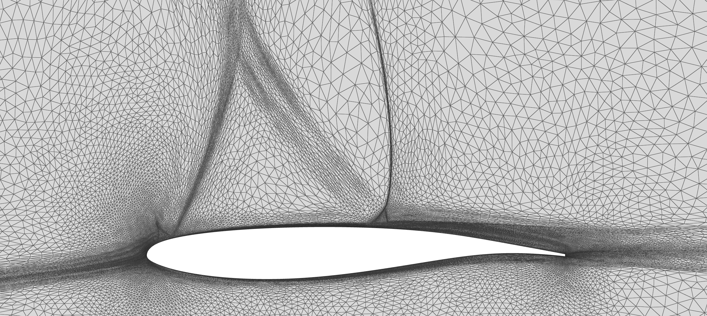

# Metris: high-order metric-based simplex remesher

Metris adapts simplex meshes provided an input metric field, and supports high-order meshes and CAD geometry. 
Only 2D is implemented yet (01/25).
Relevant publications:

- L. Rochery, M. Chiriac, M. C. Galbraith, D. L. Darmofal, S. Allmaras, "Metris: An Open-Source High-Order Metric-Based Remesher", AIAA SciTech 2025, https://arc.aiaa.org/doi/10.2514/6.2025-0779
- L. Rochery, M. C. Galbraith, D. L. Darmofal, S. Allmaras, "A Generalized Continuous Mesh Framework for Explicit Mesh Curving", AIAA SciTech 2024, https://doi.org/10.2514/6.2024-0787

## Installing Metris 

### Dependencies 

Install [LAPACK](https://www.netlib.org/lapack/) (lapacke.h required). Current version (12/24) from source:

```
git clone https://github.com/Reference-LAPACK/lapack.git 
cd lapack
mkdir build && cd build
cmake -DLAPACKE=ON -DCMAKE_INSTALL_PREFIX=<preferred location> ..
cmake --build . -j --target install
```

Run `cconfig .` before building to verify all LAPACKE related flags are set to ON. 
When choosing install prefix, be wary that LAPACK already has an `INSTALL` directory. 

Set `LAPACK_INCLUDE_DIR` environment variable to directory containing `lapacke.h` and `lapacke_mangling.h`. 
If compiled from source, this is the `<install dir>/include/` directory. 

--- 

Download and install [Engineering Sketch Pad](https://acdl.mit.edu/ESP/) following included instructions. 


### Metris compilation 

Once all dependencies are installed, simply do:

```
mkdir build && cd build
cmake .. 
make -j metris 
```

Following examples assume the executable has been added to PATH.


## Running Metris

Read a mesh `mshname.mesh(b)`, a metric field `metname.sol(b)` and carry out 20 adaptation iterations, writing final mesh `outname.meshb` and all secondary outputs to the folder `tmp/`: 

```
metris -in mshname -met metname -adapt 20 -prefix tmp/ -o outname 
```

All options are specified in the file `src/metris_options.hxx`. Default values are in `src/metris_defaults.hxx`. 
Some important options:

- `-cad`: specify `.egads` CAD file 
- `-qopt-niter`: set optimization iterations (default 5)
- `-anamet <N> -sclmet <X>`: set analytical metric `N` (as ordered in `src/msh_anamet2D.cxx` and `src/msh_anamet3D.cxx`) and scale by factor `X`
- `-tardeg <N>`: elevate mesh to degree `N`. Only degree 2 is supported in this public repository at the moment. 

The `.mesh(b)` format is defined by the [libMeshb](https://github.com/LoicMarechal/libMeshb) library. To visualize these meshes, [Vizir4](https://pyamg.saclay.inria.fr/vizir4.html)  can be used. This is freely available software designed to visualize high-order meshes with pixel-exact solution rendering. 


An example is provided in  `examples/adapt_square`. Run `test_script.sh` to adapt square meshes to uniform or example analytical metric, and `test_scriptP2.sh` to run P2 adaptation. 
Resulting uniform meshes should remain straight (as prescribed curvature vanishes if the metric field is constant) but meshes in `anamet2P2/` should be curved as if following concentric circles. 
