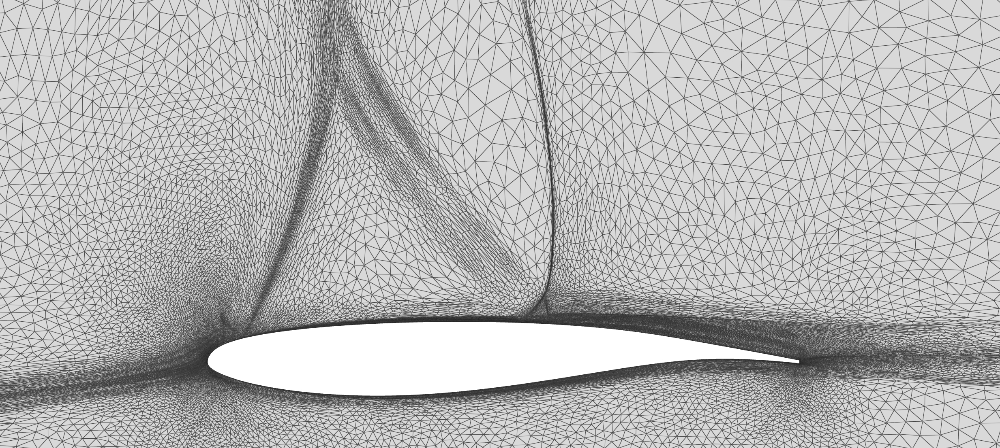

# Metris: high-order metric-based simplex remesher

Metris adapts simplex meshes provided an input metric field, and supports high-order meshes and CAD geometry. 
Early 3D stages (05/25) with surface smoothing missing. 
Relevant publications:

- L. Rochery, M. Chiriac, M. C. Galbraith, D. L. Darmofal, S. Allmaras, "Metris: An Open-Source High-Order Metric-Based Remesher", AIAA SciTech 2025, [doi](https://arc.aiaa.org/doi/10.2514/6.2025-0779), [local file](docs/rochery-et-al-2025-metris-an-open-source-high-order-metric-based-remesher.pdf)
- L. Rochery, M. C. Galbraith, D. L. Darmofal, S. Allmaras, "A Generalized Continuous Mesh Framework for Explicit Mesh Curving", AIAA SciTech 2024, [doi](https://doi.org/10.2514/6.2024-0787), [local file](docs/rochery-et-al-2024-a-generalized-continuous-mesh-framework-for-explicit-mesh-curving.pdf)

# Building and installing

## Dependencies 

- C++17
- Boost libraries. With apt: `sudo apt install libboost-all-dev`, with brew: `brew install boost`. 
- [Engineering Sketch Pad](https://acdl.mit.edu/ESP/) (download archive and follow README)


## Using Metris as a CLI tool

### Compilation

Once all dependencies are installed, create a build directory and compile:
```
mkdir -p build/<type>_<compiler> # e.g. release_clang
cmake ../..
make metris
```
A check can be done using:
```
ctest unit
```
This will: 
- Run a number of scripts calling the `metris` executable to deploy meshes (adapt to target DoFs) used in unit tests
- Run a few unit tests (< 1 min)


### Running Metris

Read a mesh `mshname.mesh(b)`, a metric field `metname.sol(b)` and carry out up to 20 adaptation iterations, writing final mesh `outname.meshb` and all secondary outputs to the folder `tmp/`: 

```
metris -in mshname -met metname -adapt 20 -prefix tmp/ -out outname 
```

All options are specified in the file `src/metris_options.hxx`. Default values are in `src/metris_defaults.hxx`. 
Some important options:

- `-cad`: specify `.egads` CAD file 
- `-qopt-niter`: set optimization (smooth + swap) iterations
- `-anamet <N> -sclmet <X>`: set analytical metric `N` (cf `src/msh_anamet(2/3)D.cxx`) and scale sizes by factor `X`
- `-tardeg <N>`: elevate mesh to degree `N`. Only 2 is supported in this public repository at the moment. 
- `-adp-opt-niter`: how many loops of (adaptation + global optimization) are allowed (expensive). 

The `.mesh(b)` format is defined by the [libMeshb](https://github.com/LoicMarechal/libMeshb) library. To visualize these meshes, [Vizir4](https://pyamg.saclay.inria.fr/vizir4.html)  can be used. This is freely available software designed to visualize high-order meshes with pixel-exact solution rendering. 

Some example meshes and CAD files are included in `examples/2D/`, `examples/3D`, and in `bunit/regression/` subdirectories. After running `ctest unit`, Metris outputs meshes to `examples/unit`. 


## Using Metris as a library with CMake

### Adding Metris to a CMake project

Metris can be used in another CMake project. First, create a build directory:
```
mkdir -p build/<type>_<compiler> # e.g. release_clang
cmake ../..
```
then compile the libraries and install them:
```
make install
```
By default, this installs the library locally to `build/<type>_<compiler>/install/`. 

This repository includes a file [cmake/FindMetris.cmake](cmake/FindMetris.cmake) that can be added to a project in order to call `find_package(Metris)`:

```
# Non-Metris project CMake script:

# Make sure CMake finds the FindMetris.cmake file:

list(APPEND CMAKE_MODULE_PATH ${CMAKE_SOURCE_DIR}/directory/containing FindMetris.cmake/ )

...

# Once FindMetris.cmake is in the CMAKE_MODULE_PATH:

find_package(Metris)

...

# This should also bring with it all required include directories:

target_link_libraries(YourTarget Metris::libMetris)
```

You should also then be able to `#include "Metris.h"` in your C++ files.  


### Running Metris as a library

Unit test files in `bunit/` can be used as examples of how Metris is used as a library. 

One way is to provide options exactly as we do the executable:
```
Metris::cargHandler arg("-in mshname -met metname -adapt 20 -prefix tmp/ -out outname ");
Metris::MetrisRunner myRunner(arg.c, arg.v);
myRunner.runMetris(); // same functionality as running metris executable
```

However, this is limited to reading files from disk. If you'd like to pass your own mesh data instead, use a `MetrisAPI` object:

```
Metris::MetrisAPI myData;
// see src/MetrisAPI/MetrisAPI.hxx for meaning of arguments:
myData.initialize(idim, ideg, imet, mshbasis, metbasis, metspace);

// either:
myData.setNPoints(npoints);
myData.setCoord(0, npoints, <raw double array sized NPoint x idim>)
// or: 
for(int ipoin = 0; ipoin < npoints; ipoin++){
  double buffer[idim];
  // fill buffer with your own data:
  ...
  myData.setCoord(ipoin,  buffer);
}
```
The other setters can be found in `src/MetrisAPI/MetrisAPI.hxx`. 
We then need to set the Metris options for the run:
```
Metris::MetrisParameters param;
// set parameters per src/MetrisRunner/MetrisParameters.hxx
param.adp_niter = 20;
param.outmPrefix = "tmp/";
param.setMeshOut(outname);
```
or, using the CLI options format:
```
Metris::cargHandler arg("-in mshname -met metname -adapt 20 -prefix tmp/ -out outname ");
Metris::MetrisOptions opts(arg.c,arg.v); // parses options
Metris::MetrisParameters(opts); // fills parameters from options
```

Finally, we create a `MetrisRunner` and call its main routine:
```
Metris::MetrisRunner myRunner(myData); // this kills myData
myRunner.runMetris();
```

### Getting data back from Metris

Once Metris has run, its data can be recovered using a `MetrisAPI` object:

```
Metris::MetrisAPI dataFromMetris(myRunner); // kills myRunner

// See src/MetrisAPI/MetrisAPI.hxx
dataFromMetris.getConstants(&idim, &ideg, &ncorn, ...);

npoints = dataFromMetris.getNPoints();
for(int ipoin = 0; ipoin < npoints; ipoin++){
  double buffer[idim];
  dataFromMetris.getCoord(ipoin, buffer);
  ...
}
```
The other getters can be found in `src/MetrisAPI/MetrisAPI.hxx`. 
