LAPACK requires linking to BLAS and libgfortran which can be troublesome to manage. 
LAPACKE is not viable because its routines do not take work arrays but instead dynamically allocate memory, which is too expensive for 2x2 or 3x3 matrices. 
Eigen promises optimized code via lazy evaluation, has statically-sized matrices, is header only and well integrated to CMake. 
We document here the differences observed with LAPACK for future reference, as we intend to make LAPACK optional (and possibly remove it altogether eventually). 

These tests were carried out on a macbook pro M4 laptop with clang as the compiler and Release mode (-O3).

Conclusions are that LAPACK is slower than Eigen or `src/linalg/dsyevq.(c|h)xx` (an implementation of dsyevq by Joachim Kopp) for eigendecomposition of spd matrices, and Eigen can be slightly faster than dsyevq followed by exp but only in dimension 3 for matrix exponentiation. 

# Eigen decomposition

We begin by testing symmetric matrix eigendecomposition using:
  - The Joachim Kopp implementation of dsyevq, see `src/linalg/dsyevq.(c|h)xx`  and `src/linalg/dsytrd.(c|h)xx`. We originally included this to plug in SANS::SurrealS (automatic differentiation). 
  - LAPACK dsyevq, using the LAPACK libraries installed by homebrew on MacOS. 
  - Eigen with `SelfAdjointEigenSolver`  

The unit test and benchmark is `bunit/test_eigen.cxx`. 
We construct metrics of increased anisotropy ratio defined as the ratio of mesh sizes. 
Recall the eigenvalues are `\lambda_i = 1/h_i^2` so the matrix conditioning is in fact increasing with the square of the anisotropy ratio. 
The largest size is in the order of 1, it is the smallest size (i.e. largest eigenvalue) which is decreased to enforce the ratio. 
We consider ratios from 2 to 2e7 and sample 1e5 metrics per ratio, with a fixed seed. 

## Whole eigenvalue vector relative errors

This error is computed by taking the 2-norm error of the eigenvalue vectors as a whole, divided by the 2-norm of the reference eigenvalue vector.
As the largest eigenvalue increases with anisotropy, errors in the smaller eigenvalues become invisible. 
In all cases, eigenvalues appear obtained to machine zero relative error.

  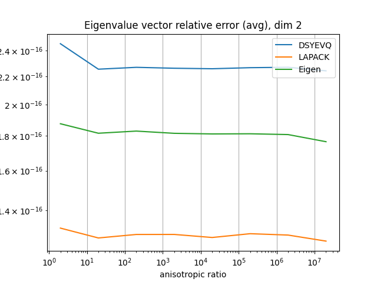
  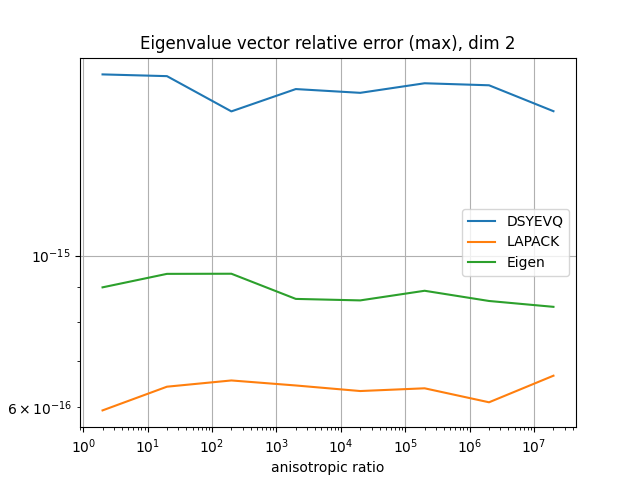

  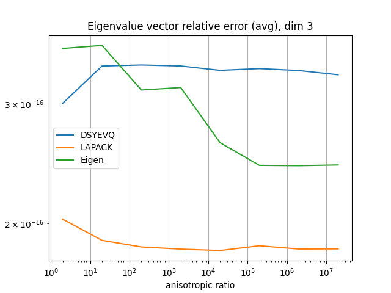
  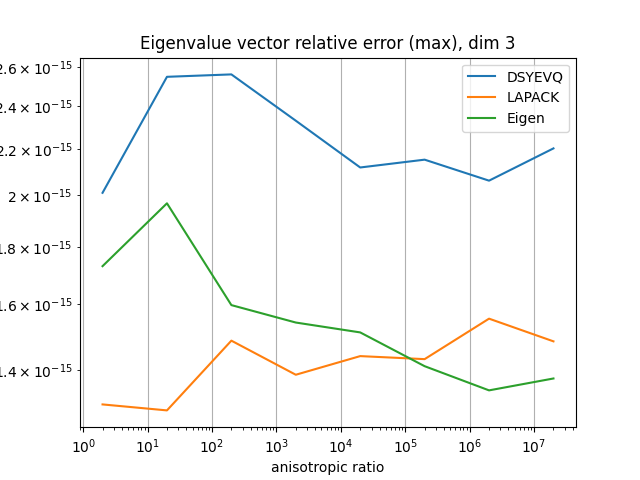

## Per eigenvalue relative errors

In this case, we consider the relative error per eigenvalue. 
Absolute errors on the smallest eigenvalues are no longer offset by the large magnitude of the largest eigenvalue, and the relative errors appear much larger (and grow geometrically with anisotropy).
At a glance, it appears the relative error on any eigenvalue behaves as *O(r^1)*, with *r* the anisotropy ration (square root of the matrix spectral radius). 
These results indicate eigendecompositions should be avoided as much as possible, and all three functions behave similarly. 

  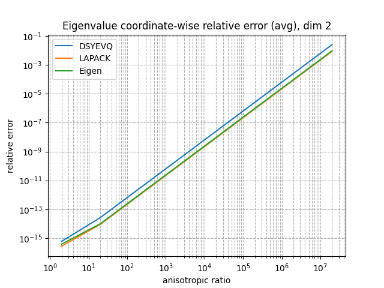
  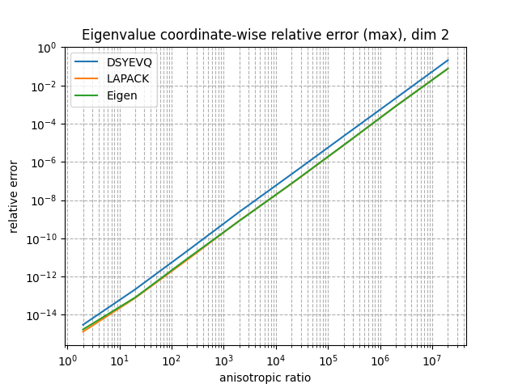

  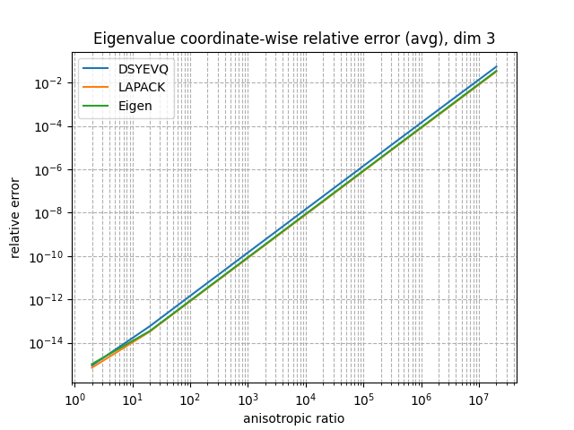
  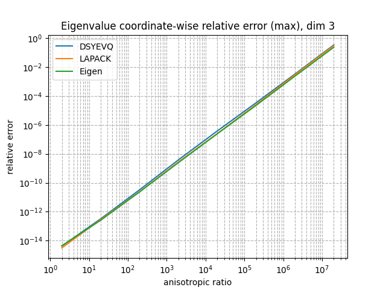

## Performance

Lastly, we benchmarked the three functions and compared operations per second to LAPACK. 
Speedup with respect to LAPACK increases with anisotropy. 
Eigen appears always slower than DSYEVQ but still offers from x1.5 to x4 higher performance than LAPACK. 
DSYEVQ remains an attractive alternative. 

  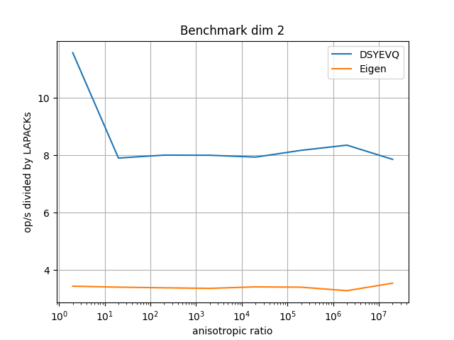
  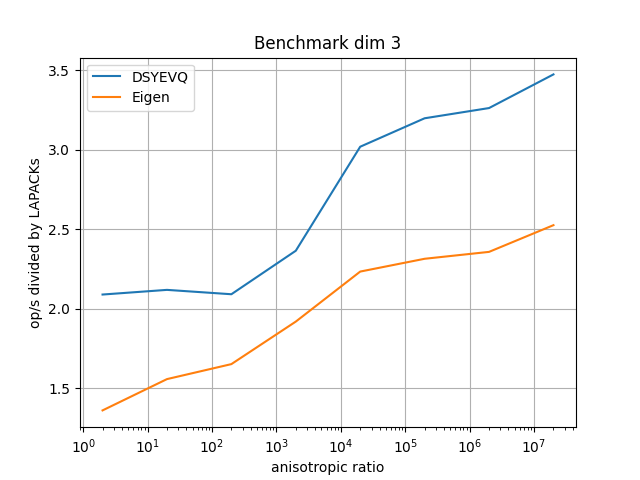

## Conclusion

All three functions/libraries appear as competent in terms of numerical robustness. 
DSYEVQ is the fastest by a factor 2x to Eigen, resp 8x to LAPACK in 2D, and a factor depending on conditioning in 3D (as high as 3.5x higher than LAPACK, about 1.5x than Eigen). 
Hence, it would be preferable to keep this function as the eigenvalue decomposition solver, and LAPACK can be set aside for this task altogether. 

In the future, it could be worthwhile to attempt using the Eigen solver with the auto differentiation type SANS::SurrealS typed matrices and compare robustness and speed to DSYEVQ (which supports SANS::SurrealS). 

# Matrix exponential / logarithm

We now test spd matrix exponential/logarithm computation using:
  - (DSYEVQ) Using the above Joachim Kopp DSYEVQ implementation to compute eigenvalues, composing by log/exp, then recomposing the metric. 
  - (Eigen1) Using Eigen's `.exp()` and `.log()` functions on matrices. 
  - (Eigen2) Same as (DSYEVQ) but using Eigen to compute the eigendecomposition.

The unit test and benchmark is `bunit/test_expmet.cxx`. 
Metrics are constructed as before. 
When exponentiation is tested, eigenvalues are composed by log before composing at generation. 
As before, we consider size ratios from 2 to 2e7 and sample 1e5 metrics per ratio, with a fixed seed. 

## Errors

### Matrix exponential

The error is the relative 2-norm error between exponentiated metric and metric obtained by computing the exponential of the randomly generated eigenvalues and then composing. 
The maximum error over the 100000 samples is reported. 
Overall, the error stagnates and remains acceptably low throughout. 
It is marginally more accurate to carry out eigendecomposition instead of scaling and squaring (what Eigen's `.exp()` uses), but this might depend on Eigen's tolerance choices. 

  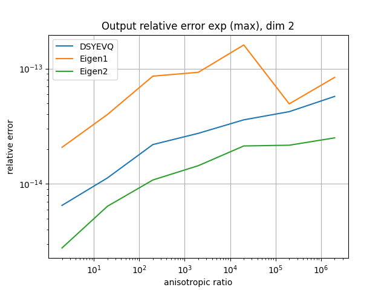
  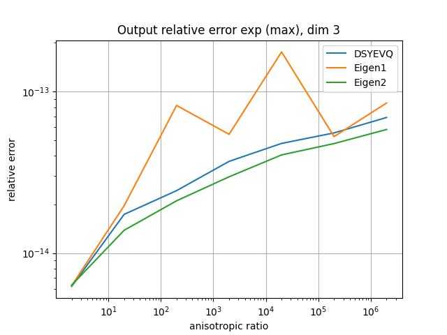

### Matrix logarithm

Error is the same as before but now with the logarithm. 
In this case, the error appears sensitive to the matrix conditioning, and increases roughly as *O(r^1)*. 
Even at moderate anisotropy ratios (1000), the error reaches around 1e-10, which is beginning to be large.

  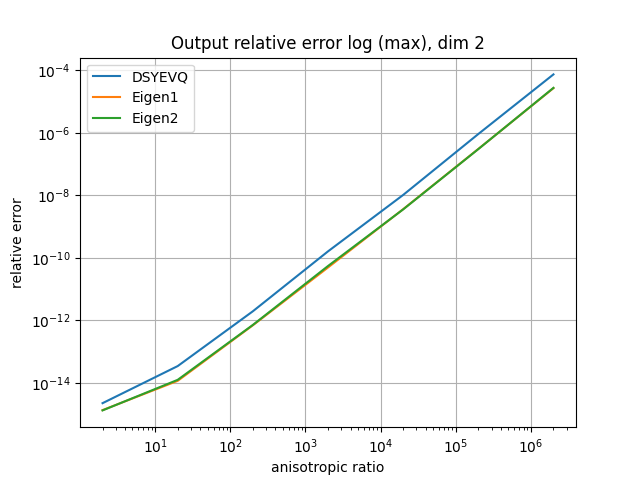
  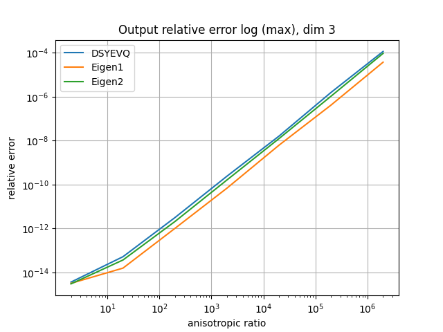

## Performance

Performance of the Eigen approaches is compared to DSYEVQ. 
This is in operations per second divided by that of DSYEVQ. 
The logarithm is always slower using Eigen. 
The exponential using Eigen's scaling and squaring (EIGEN1) is about 30% faster than DSYEVQ, but only in dimension 3, otherwise it is about half as fast... 

Not reported here is the absolute cost of these operations. 
About 24M op/s are carried out in 2D, and 4.5M/s in 3D (macbook pro M4 and clang as the compiler). 

### Matrix exponential

  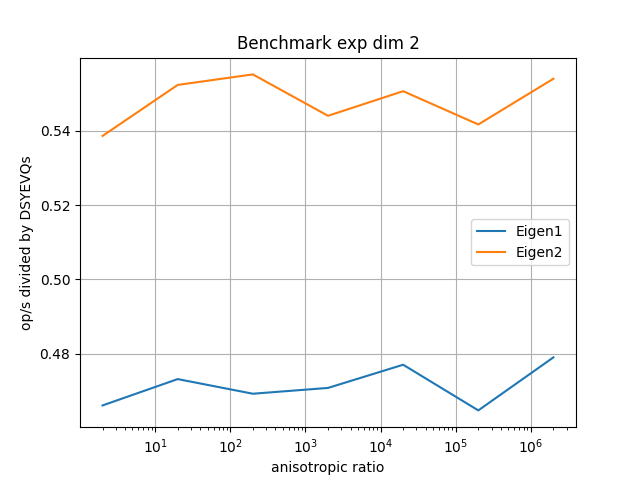
  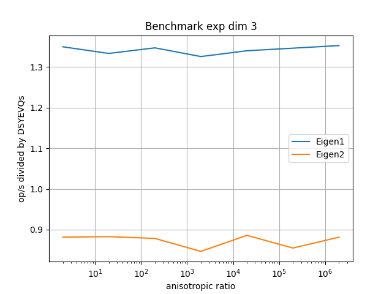

### Matrix logarithm

  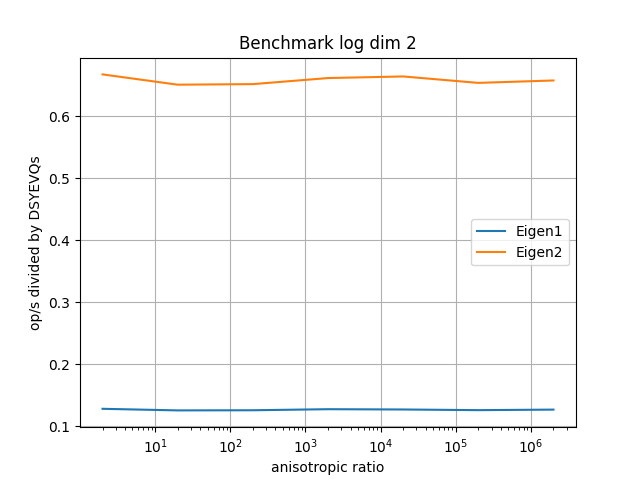
  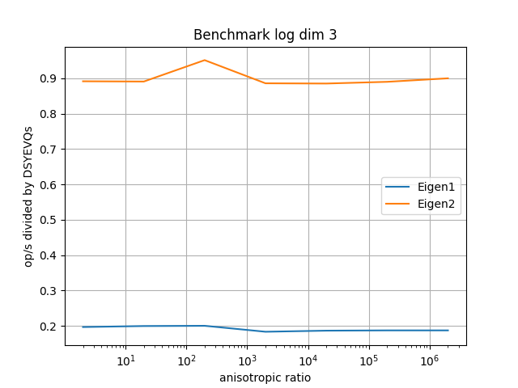

## Conclusion

Matrix logarithm should be avoided as it leads to large relative errors on more anisotropic meshes. 
Exponentiation appears insensitive to anisotropy relatively speaking (the denominator of the relative error does increase exponentially). 
It appears Eigen would be preferable to DSYEVQ only for dimension 3 matrix exponentiation using its builtin `exp()` which uses scaling and squaring. 

# Determinant (symmetric matrices)

We unfortunately need determinant computations to compute volumes under the metric. 
We compare:

- Naive determinant computation
- Using LAPACK `dgetrf` (LU factorization)
- Using Eigen's `.determinant()`
- Using Eigen's LL^T and LDL^T factorizations

## Errors

A truth value is computed using naive determinant computation with octuple precision `boost::multiprecision::cpp_bin_float_quad`. 
The error is relative. 

Determinants of 2x2 matrices are equally well/badly computed in all cases. 
However, the naive computation and Eigen's `.determinant()` are very unstable on 3x3 matrices, with relative errors >1e10 at high anisotropy. 
These are completely unusable. 

  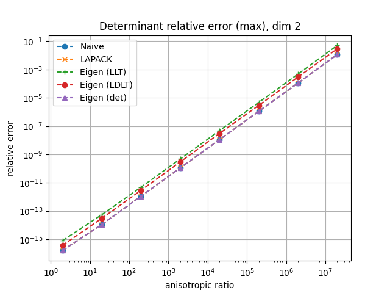
  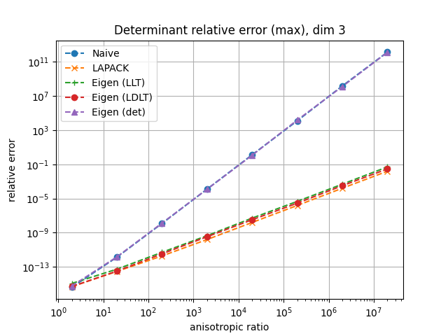

## Performance

### Context

Possibly our most performance critical uses of the determinant is in computing element qualities (`quafun_tradet`). 
To contextualize the results, this function was benchmarked (`bench_quafun_tradet`) after removing determinant calls. 
The input meshes (hence the back, hence the metric) were 2D Q1 or Q2 and the front mesh was (when appropriate) elevated to degree 2. 
In summary, the core of the quality computation can be carried out about **17M/s in 2D** regardless of degree, and **4M/s in 3D** on the Mac machine, and resp. **11M/s in 2D**, **3.5M/s in 3D** on the Linux workstation.

| Case          | type | ideg | Mac M3 clang | Linux Intel i9-9900K gcc |
|---------------|------|------|--------------|--------------------------|
| 2D Q1         | 2D   | 1    | 21882k/s     | 12027k/s                 |
|               | 2D   | 2    | 18947k/s     | 10480k/s                 |
| 2D Q2         | 2D   | 2    | 18790k/s     | 10532k/s                 |
|               | 2D   | 2    | 16845k/s     | 10557k/s                 |
| 3D Q1         | surf | 1    | 4000k/s      | 4010k/s                  |
|               | 3D   | 1    | 4410k/s      | 3904k/s                  |
|               | surf | 2    | 4640k/s      | 3809k/s                  |
|               | 3D   | 2    | 4108k/s      | 3397k/s                  |

### Results

All approaches are compared to the naive (fastest) approach. 
There is little variation in 2D and the absolute speeds are very large (we don't need determinant computations very intensively), in the order of 1e9 op/s. 
In 3D, LAPACK is 100x slower than the naive approach, Eigen's decompositions only about 10x slower. 
In absolute terms, Eigen carries out about 100M determinant computations a second in 3D and 700M/s in 2D (Mac setting), which does not prove a limiting factor. 

<figure style="text-align: center;">
  

    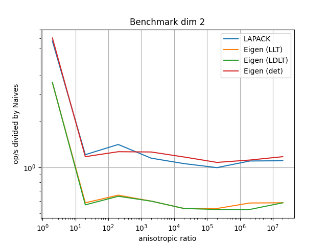
    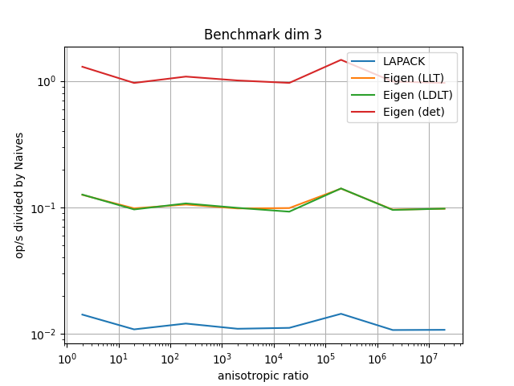
  

  <figcaption style="margin-top: 0.5em; font-style: italic;">
    Figure: Benchmark results on the Mac machine with clang
  </figcaption>
</figure>

<figure style="text-align: center;">
  

    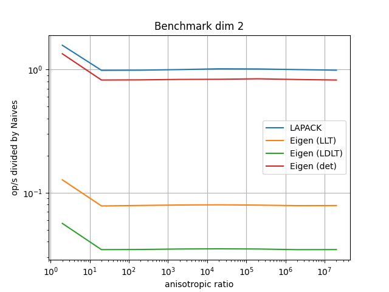
    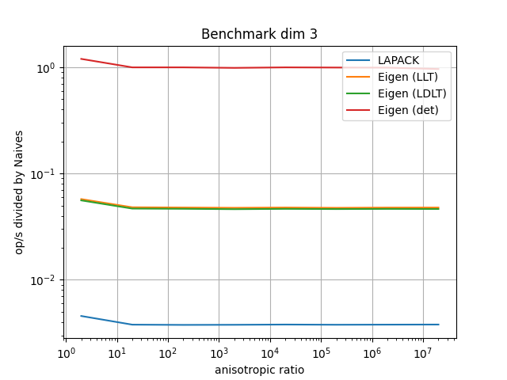
  

  <figcaption style="margin-top: 0.5em; font-style: italic;">
    Figure: Benchmark results on the Linux machine with gcc
  </figcaption>
</figure>

## Extended precision 

None of the determinant computation methods are precise enough on highly anisotropic meshes. 
Furthermore, we still have some performance margin to work with, as currently using Eigen's LLT with double precision is about 30x faster, resp. 25x in 3D than computing `quafun_tradet`. 
Hence we could slow it down by another factor of 25x (but ideally less) before it takes up a majority of the time in quality computation. 

## Conclusion

None of the determinant computation methods are satisfactory from the standpoint of precision using double precision. 
Extended precision is expensive on machines that don't offer hardware acceleration for `long double` (e.g. the Mac M3). 
As much as possible, we should avoid determinant computations on metrics. 
It should also be investigated whether computing JK^T M J_K or det(J_K)^2 det(M) is more appropriate. 
In the former case, the matrix is more or less the identity, but to get there requires possibly inaccurate matrix multiplications (J_K is "very small" and M is "very large"). 

Depending on the platform, the accurate options are:
- If `long double` is implemented in hardware, Eigen's LLT with `long double`
- Otherwise, naive determinant with quadruple precision. 

The latter's cost is comparable to a whole `quafun_tradet` computation, hence this configuration should near double quality computation time... 

